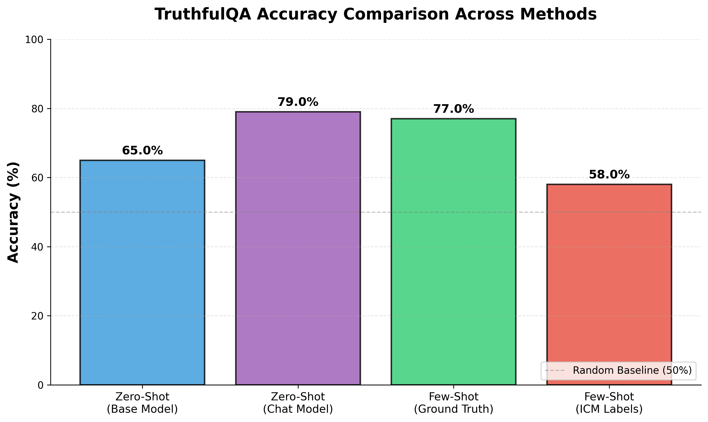

# Replication of Internal Coherence Maximization (ICM)

[](https://www.python.org/downloads/) [](https://opensource.org/licenses/MIT) [](https://github.com/psf/black) [](https://github.com/astral-sh/ruff) [](https://github.com/astral-sh/uv) [](https://github.com/pre-commit/pre-commit)

Task description [here](https://praxis-research.org/sprints/unsupervised-elicitation). Essentially, this repo reimplemented ICM WITHOUT logical consistency fix, and ran it on a subset of TruthfulQA dataset by feeding results as few-shot examples to a base model.

## Results



Two caveats:

- The results may not exactly match the paper's numbers due to: 1) randomness in LLM generation, 2) possible differences in model versions, 3) this ICM version doesn't include logical consistency fix.
- Zero-shot with chat model (Llama-3.1-405B-instruct) initially gave lower accuracy (50%) than base model (~65%) since 25-30% of responses were empty and must be skipped when parsing labels. The accuracy was raised after adding retry mechanism for empty response.

## Set up

1. Require Python>=3.10, <=3.13 (test with Python 3.12, as specified in .python-version)
2. Get uv if you haven't to manage packages and run scripts.
3. Fork/clone the repo.
4. Run the set up code in the terminal

```sh
chmod +x setup.sh
sh setup.sh
```

You should be in the virtual environment named "praxis-sprint-icm". If not, manually activate it with

```sh
source .venv/bin/activate
```

5. Go to .env and fill in the secrets. You need a Hyperbolic API key.

## Replication

### To generate the figure

You can re-generate the main figure from saved results by running

```sh
uv run src/figure.py
```

### To run the full pipeline

To run the full pipeline from data loading, ICM prediction, evaluation to figure generation, run

```sh
uv run src/main.py
```

then generate figure with the command above.

You can also each evaluation scenario separately by running

```sh
uv run src/main.py --<scenario>
```

where `<scenario>` can be one of `zero_shot_base`, `zero_shot_chat`, `few_shot_golden`, `few_shot_icm`. Note that running `few_shot_icm` will also run ICM prediction if not done before, and could take around 30-40 mins for test set.

Run with `-h` to see all options, or check [src/main.py](src/main.py) for details.

```sh
uv run src/main.py -h
```
